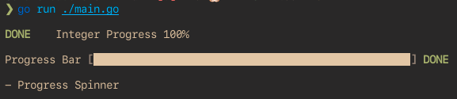

# GoFakeLoaders
 
Dummy loaders for your Go projects

## Usage
Below are the syntaxes of all three progress types:

```go

/** Integer Progress **/
progress(speed int, caption string)
// Example:
progress(2000, "Integer Progress")

/** Progress Bar **/
progressBar(speed int, caption string)
// Example:
progressBar(2000, "Progress Bar")

/** Progress Spinner **/
progressSpinner(speed int, caption string)
// Example:
progressSpinner(2000, "Progress Spinner")
```

> Important: This will only work on Linux and MacOS, because it makes use of escape codes that Windows can't understand.

## Demo
Here is a screenshot of all three loaders in their completed state:


